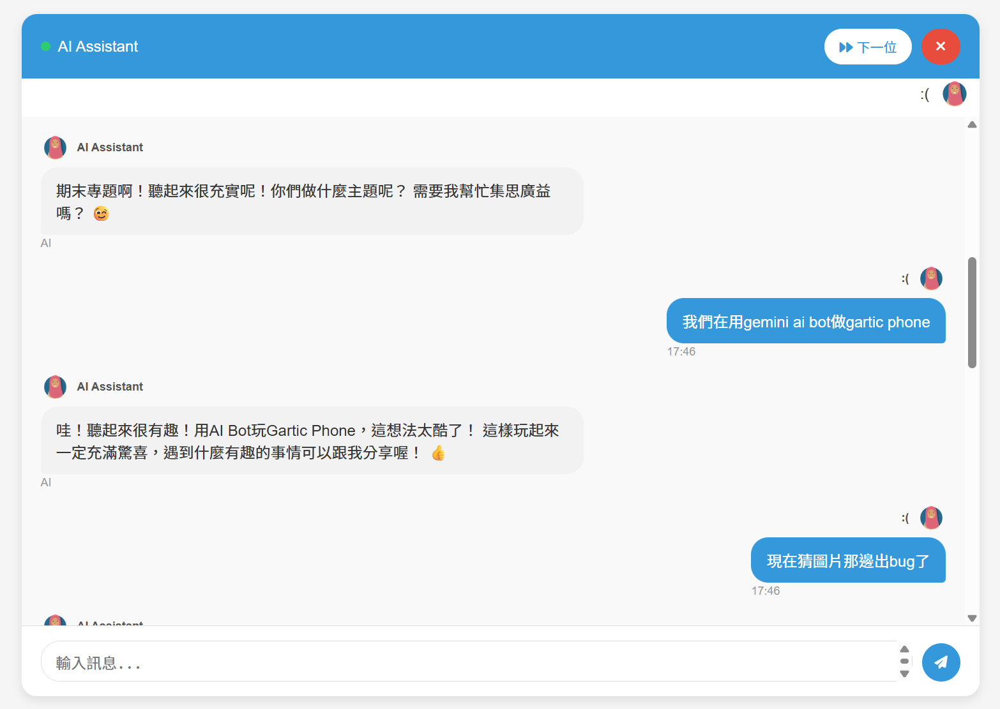

# Week13 Homework

## Docker Image

Docker Hub 連結：

https://hub.docker.com/r/ytcytc/team06-web


Pull 指令：

```bash
docker pull ytcytc/team06-web:latest
```

Docker 啟動方式說明：
```bash
git clone https://github.com/Dannyyang0329/Team06.git
cd Team06

docker-compose up
```

預設網站：

http://localhost:8000

## 1. 練習了哪些當週上課的主題

### Django Rest Framework
1. 設定 settings.py
    (1) 在 ```INSTALLED_APPS``` 中加入 ```"rest_framework"```
    (2) 加入 ```REST_FRAMEWORK```

2. Serializers: serializers.py
為 models.py 中每個 model 設定一個新的 serializer。

3. 整合 serializer 於 consumer.py 程式邏輯中：
由於我們使用 websocket，因此很多物件的建立並不是使用 API GET/POST，而是直接使用 ```[Model].objects.create()```如下：
```python
from .model import User
user, created = User.objects.update_or_create(
    user_id=user_id,
    defaults={
        'nickname': nickname,
        'avatar': avatar,
        'mood': mood,
        'gender': gender,
        'channel_name': channel_name
    }
)
```
舊有寫法的缺點是，如果傳入一整個dictionary，需要逐個item寫下。利用serializer，我們可以直接用：
```python
from .serializers import UserSerializer

serializer = UserSerializer(data=user_data)            
if serializer.is_valid():
    # 條件檢查寫這裡，例如檢查 user_id 是否存在
    user = serializer.save()
    return user
else:
    logger.error(f"Invalid user data: {serializer.errors}")
    raise ValueError(f"Invalid user data: {serializer.errors}")
```
還可以順便檢查欄位。

### JSON Web Token
我們在專案中使用了 JSON Web Token (JWT) 來實現用戶的身份驗證，以下是相關說明：

1. **功能介紹**
   - JWT 是一種輕量級的身份驗證機制，通過加密的 Token 傳遞用戶身份資訊，避免每次請求都查詢資料庫。

2. **安裝方式**
   - 在 `requirements.txt` 中加入：
     ```
     djangorestframework-simplejwt
     ```

3. **設定方式**
   - 在 `settings.py` 中加入：
     ```python
     REST_FRAMEWORK = {
         'DEFAULT_AUTHENTICATION_CLASSES': (
             'rest_framework_simplejwt.authentication.JWTAuthentication',
         ),
     }
     ```
   - 配置 JWT 的有效期等參數：
    ```python
    from datetime import timedelta
     
    SIMPLE_JWT = {
        'ACCESS_TOKEN_LIFETIME': timedelta(minutes=60),  # Increased for testing
        'REFRESH_TOKEN_LIFETIME': timedelta(days=1),
        'ROTATE_REFRESH_TOKENS': True,
        'BLACKLIST_AFTER_ROTATION': True,
        'ALGORITHM': 'HS256',
        'SIGNING_KEY': SECRET_KEY,
        'AUTH_HEADER_TYPES': ('Bearer',),
        'USER_ID_FIELD': 'user_id',  # Use user_id instead of id
        'USER_ID_CLAIM': 'user_id',  # Use user_id in the JWT claims
    }
    ```

4. **自訂 JWT 序列化器**
   - 我們自訂了 `CustomTokenObtainPairSerializer`，讓 Token 中包含用戶的 `user_id` 和 `nickname`：
     ```python
     class CustomTokenObtainPairSerializer(TokenObtainPairSerializer):
         username_field = 'user_id'

         def validate(self, attrs):
             credentials = {
                 'user_id': attrs.get('user_id'),
                 'password': attrs.get('password')
             }

             user = authenticate(**credentials)
             if user:
                 data = super().validate(attrs)
                 data['user_id'] = user.user_id
                 data['nickname'] = user.nickname
                 return data
             else:
                 raise serializers.ValidationError('無法使用提供的認證資訊登入')
     ```

5. **登入與登出功能**
   - **登入**：用戶提供 `user_id` 和 `password`，後端驗證成功後返回 JWT：
     ```python
     class CustomTokenObtainPairView(TokenObtainPairView):
         serializer_class = CustomTokenObtainPairSerializer
     ```
     - 返回的 Token 範例：
       ```json
       {
           "access": "...",
           "refresh": "...",
           "user_id": "user123",
           "nickname": "John Doe"
       }
       ```
   - **登出**：用戶提供 "refresh" Token，後端將其加入黑名單：
     ```python
     class LogoutView(APIView):
         permission_classes = [IsAuthenticated]

         def post(self, request):
             try:
                 refresh_token = request.data.get("refresh")
                 if not refresh_token:
                     return Response({"error": "Refresh token is required"}, status=400)

                 token = RefreshToken(refresh_token)
                 token.blacklist()

                 return Response({
                     "success": True,
                     "message": "您已成功登出",
                     "status": "Token has been blacklisted"
                 })
             except Exception as e:
                 return Response({
                     "success": False,
                     "error": str(e),
                     "message": "登出時發生錯誤"
                 }, status=400)
     ```

6. **使用方式**
   - 用戶登入後，後端會生成一個 JWT，返回給前端：
     ```json
     {
         "access": "...",
         "refresh": "...",
         "user_id": "user123",
         "nickname": "John Doe"
     }
     ```
   - 前端在後續請求中，將 `access` Token 放入 HTTP Header：
     ```
     Authorization: Bearer <access_token>
     ```

7. **優點**
   - 無狀態：不需要在伺服器端保存用戶會話。
   - 高效：Token 自帶用戶資訊，減少資料庫查詢。
   - 安全性：通過黑名單機制，實現 Token 的即時失效。

8. 實作上遇到的困難
由於 Django 本身也有一個 `User` model，而且是 JWT 預設使用的 model，因此需要在 webhw/settings.py 中改變預設的 model：
    ```python
    # 指定使用自定義的 User model
    AUTH_USER_MODEL = 'frontend.User'
    ```

### API 串接: Gemini

我們在專案中使用 Google Gemini API 作為 AI 聊天機器人的核心，以下是實作與串接的詳細說明：

1. **環境變數設定**
   - 在專案根目錄新增 `.env` 檔案，並填入以下內容：
     ```
     GEMINI_API_KEY=你的Google Gemini API金鑰
     ```
   - 確保專案已安裝 `python-dotenv` 套件，Django 啟動時會自動載入 `.env` 檔案中的環境變數。

2. **Gemini API 使用方式**
   - 我們使用 `openai` 套件來與 Google Gemini API 進行互動。
   - 在 `consumers.py` 中實作了 `get_gemini_response` 方法，該方法會根據用戶的訊息呼叫 Gemini API 並回傳 AI 的回覆。

3. **聊天歷史功能**
   - 我們實作了聊天歷史功能，讓每次與 Gemini API 通信時，會將完整的聊天記錄傳遞給 API，確保 AI 能記住對話上下文。
   - 聊天歷史會包含用戶的所有訊息以及 AI 的回覆，並在每次對話後更新。

4. **程式碼範例**
   以下是 `get_gemini_response` 方法的實作：
   ```python
   async def get_gemini_response(self, user_message):
       from openai import OpenAI
       import os

       api_key = os.environ.get('GEMINI_API_KEY')
       client = OpenAI(
           api_key=api_key,
           base_url="https://generativelanguage.googleapis.com/v1beta/openai/"
       )

       # 將聊天歷史加入到 messages 中
       messages = self.chat_history + [
           {"role": "user", "content": user_message}
       ]

       try:
           response = await sync_to_async(client.chat.completions.create)(
               model="gemini-2.0-flash",
               messages=messages
           )
           bot_reply = response.choices[0].message.content

           # 將用戶訊息和機器人回覆加入聊天歷史
           self.chat_history.append({"role": "user", "content": user_message})
           self.chat_history.append({"role": "assistant", "content": bot_reply})

           return bot_reply
       except Exception as e:
           return f"[AI服務異常] {e}"
   ```
5. 實際聊天範例


## 2. 額外找了與當週上課的主題相關的程式技術

### python-dotenv
為了讓專案更方便管理環境變數，我們使用了 `python-dotenv` 套件，以下是相關說明：

1. **功能介紹**
   - `python-dotenv` 允許我們將敏感資訊（如 API 金鑰、資料庫密碼）存放在 `.env` 檔案中，並在程式啟動時自動載入這些變數到環境變數中。

2. **安裝方式**
   - 在 `requirements.txt` 中加入：
     ```
     python-dotenv
     ```

3. **使用方式**
   - 在專案根目錄新增 `.env` 檔案，範例如下：
     ```
     GEMINI_API_KEY=你的Google Gemini API金鑰
     ```
   - 在程式碼中載入 `.env` 檔案：
     ```python
     from dotenv import load_dotenv
     import os

     load_dotenv()  # 自動載入 .env 檔案
     api_key = os.getenv('GEMINI_API_KEY')
     ```

4. **優點**
   - 提高安全性：敏感資訊不會直接寫在程式碼中。
   - 易於管理：不同環境（如開發、測試、正式環境）可以使用不同的 `.env` 檔案。


## 3. 組員分工情況

第6組：
* 賴佑寧 (25%): Django Rest Framework, JWT,  Gemini API
* 鄭宇彤 (25%): Django Rest Framework, JWT,  Gemini API
* 楊育勝 (25%): Django Rest Framework, JWT,  Gemini API
* 黃唯秩 (25%): Django Rest Framework, JWT,  Gemini API